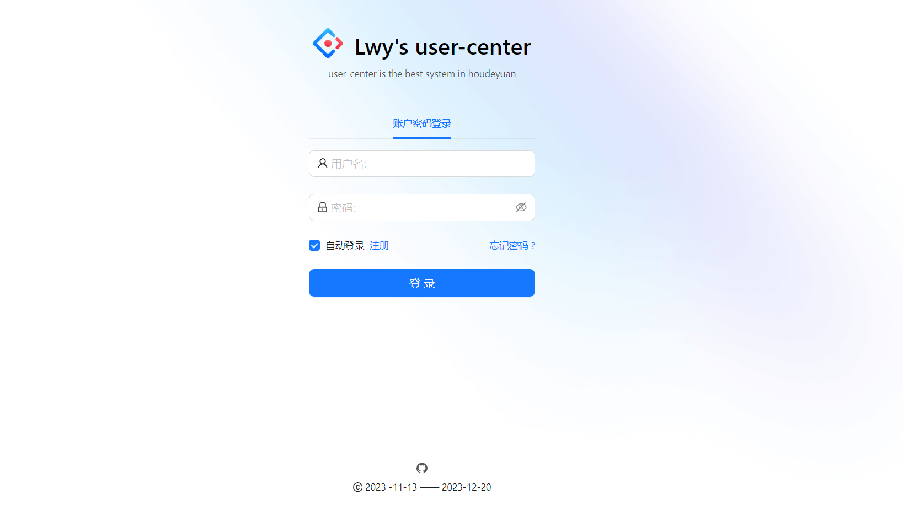
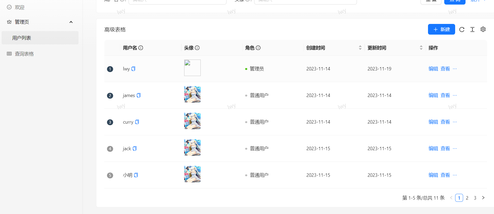

# 用户中心项目

## 项目简介

### 项目介绍

基于Koa + React的一站式用户管理系统，实现了用户注册、登录、查询管理等功能。

如图：






> 本系统功能并不复杂，只是简单的实现了对用户的增删改查功能，特点在于该系统是个人学习基于Node服务器开发之后使用Koa框架独立完成了前端和后端的实现

### 项目收获

1. 更加清晰了做项目前后端交互的完整流程，能够独立开发及上线项目

2. 锻炼了自己的独立开发和阅读官方文档的能力

3. 锻炼了自己解决问题的能力

   

## 技术介绍

### 前端

#### 目录结构

```js
|-- user-center-forntend
    |-- config        //项目配置文件
    |   |-- config.ts
    |   |-- defaultSettings.ts
    |   |-- oneapi.json
    |   |-- proxy.ts   //代理配置
    |   |-- routes.ts  //路由配置
    |-- public      // 公共资源文件
    |-- src         
    |   |-- access.ts  //判断权限
    |   |-- app.tsx   //主文件
    |   |-- global.less  //全局样式
    |   |-- requestErrorConfig.ts  //网络请求文件
    |   |-- components       //项目组件
    |   |   |-- Basis_Form   // 展示表单公共组件
    |   |   |   |-- BasisFormStyled.js
    |   |   |   |-- index.jsx
    |   |   |-- Footer   //登录底部组件
    |   |   |   |-- index.tsx
    |   |   |-- RightContext  //展示当前用户信息
    |   |   |   |-- UserInfo.jsx
    |   |   |   |-- UserStyled.js
    |   |   |-- WaterMark  //水印
    |   |       |-- index.jsx
    |   |       |-- WaterMarkStyled.js
    |   |-- constants  // 常量
    |   |   |-- user.js
    |   |-- pages    
    |   |   |-- 404.tsx  
    |   |   |-- Admin.tsx    //管理员组件
    |   |   |-- Welcome.tsx  //欢迎页面
    |   |   |-- TableList 
    |   |   |   |-- index.tsx
    |   |   |   |-- components
    |   |   |       |-- UpdateForm.tsx
    |   |   |-- User    //用户登录注册
    |   |       |-- Login
    |   |       |   |-- index.tsx
    |   |       |   |-- login.test.tsx
    |   |       |   |-- __snapshots__
    |   |       |       |-- login.test.tsx.snap
    |   |       |-- Register
    |   |           |-- index.tsx
    |   |           |-- login.test.tsx
    |   |           |-- __snapshots__
    |   |               |-- login.test.tsx.snap
    |   |-- services     //api请求
    |   |   |-- ant-design-pro
    |   |       |-- api.ts
    |   |       |-- index.ts
    |   |       |-- login.ts
    |   |       |-- typings.d.ts
    |   |-- utils   //工具
    |       |-- LocalStorage.js
    |-- types   类型
        |-- index.d.ts
        |-- cache
            |-- cache.json
            |-- login.cache.json
            |-- mock
                |-- login.mock.cache.js
                |-- mock.cache.js

```

- 主要运用阿里Ant Design生态：
  - HTML+CSS+JavaScript三件套
  - React开发框架
  - Ant Design Pro项目模板
  - Ant Design瑞组件库
  - Umi开发框架
  - Umi Request请求库

### 后端

#### 目录结构

```js
|-- user-center-backend
    |-- .env  服务器地址端口
    |-- src 
    |   |-- main.js   //项目入口文件
    |   |-- app      //创建Koa
    |   |   |-- app.js
    |   |-- config    //对错误处理、token等服务配置文件
    |   |   |-- error.js
    |   |   |-- secretKey.js
    |   |   |-- server.js
    |   |   |-- keys
    |   |       |-- private.key
    |   |       |-- public.key
    |   |-- controller   //处理层
    |   |   |-- login.controller.js
    |   |   |-- user.controller.js
    |   |-- middleware   //公共中间件
    |   |   |-- login.middleware.js
    |   |   |-- user.middleware.js
    |   |-- router  //路由请求
    |   |   |-- index.js  //动态注册路由
    |   |   |-- login.router.js
    |   |   |-- user.router.js
    |   |-- service   //查询数据库
    |   |   |-- fileService.js
    |   |   |-- index.js
    |   |   |-- userService.js
    |   |-- utils    //对全局异常返回统一处理
    |       |-- error_handle.js
    |       |-- md5_password.js   //用户密码加密
    |-- uploads   //上传图片
        |-- af2ccf3cfa2bef75ed2391e7c02a00b6

```

- 主要使用了Koa框架进行了项目开发
  - 基于jwt实现token实现了登录验证操作
  - 对全局异常统一处理
  - 写了一个工具对文件进行读取，实现动态注册路由功能
  - 实现了对用户这个增删改查等功能

